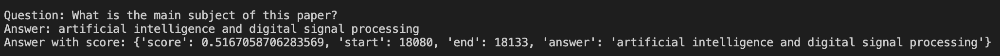
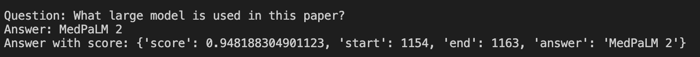

# Question-Answering from PDF

## Overview
This project extracts text from PDF documents and applies a Question-Answering (QA) model to provide insights based on the extracted content. It uses multiple text extraction techniques, including:
- **pdfplumber** for direct text extraction
- **PyMuPDF (fitz)** for extracting images from PDFs
- **Tesseract OCR** for Optical Character Recognition (OCR) on images

The extracted and cleaned text is then processed using a **BERT-based QA model** to answer user queries.


## Dependencies
Ensure you have the following dependencies installed:

1. Create and activate a virtual environment 
2. Install required dependencies  
```bash
pip install -r requirements.txt
```


## Usage
1. Place your PDF file in the `data/` directory.
2. Run the script:

```bash
python qa_from_pdf.py
```

3. Examples:




## Model Used
This project uses the **deepset/bert-base-cased-squad2** model from Hugging Face, which is fine-tuned on the **SQuAD 2.0** dataset for question answering.

## Future Improvements
- Improve OCR accuracy using **Tesseract configurations**
- Support multilingual QA models
- Enhance text extraction with **layout detection** for complex documents

